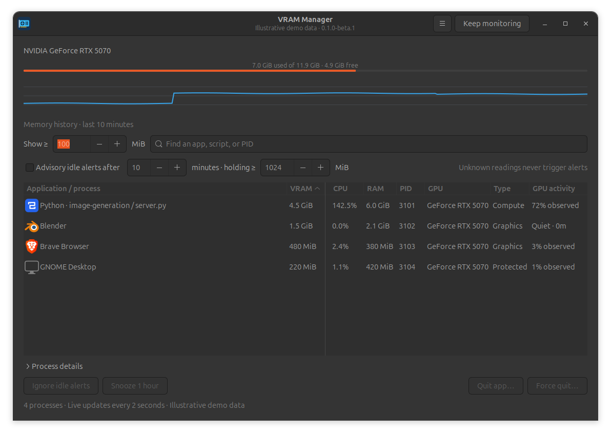

# VRAM Manager

See what holds your GPU memory. Quit the apps you choose.

A small native Linux desktop app for NVIDIA GPUs. Lists graphics **and** compute processes using at least 100 MiB, with readable names, installed app icons, live CPU/RAM context, memory history, and optional idle alerts.



## Install the Ubuntu 24.04 beta

Download the `.deb` and `SHA256SUMS` from [GitHub Releases](https://github.com/Elhelali/vram-manager/releases). In your download folder:

```sh
sudo apt install ./vram-manager_0.1.0~beta1_all.deb
```

Open **VRAM Manager** from Applications, or run `vram-manager`. You need an NVIDIA driver that provides a working `nvidia-smi`. The installer does not choose or replace your GPU driver. This beta targets Ubuntu 24.04; its hardware baseline is RTX 5070 with NVIDIA 580.178.04. Other GPUs/drivers and multi-GPU setups need further hardware testing. AMD, Intel, Windows and macOS are unsupported.

Upgrade by installing the newer `.deb` the same way. Uninstall with `sudo apt remove vram-manager`. Settings remain in `~/.config/vram-manager/settings.json` (or under `$XDG_CONFIG_HOME`). Delete that file only to reset preferences.

## Use it

- Updates automatically about every two seconds. Sort by clicking a heading; search by app, script, executable or PID.
- **RAM** is resident system memory (RSS) for the GPU PID; shared pages may be counted more than once. **CPU** is interval usage, with 100% representing one core; multithreaded processes can exceed 100%. A dash means not enough data yet. These are per-process values, not app-family totals.
- Uses MiB/GiB, matching NVIDIA's binary units. Default minimum is 100 MiB.
- The graph shows total memory in use over ten minutes, held only in memory. Missing readings leave gaps.
- Expand **Process details** to see the selected process's executable and app quit target.
- **Quit app** requests termination; **Force quit** stops it immediately. Both require confirmation and may lose unsaved work. Browser/Electron GPU helpers resolve to the parent app, closing its windows.
- Xorg, GNOME, common compositors and display managers are visible but protected from termination. Other users' processes may reject termination; the app never elevates privileges.
- Quit feedback checks for exit, total free-memory changes, and new matching GPU processes that may indicate restart. Other apps affect the total memory change too.
- Thresholds, alert preferences, ignored apps, window size and sorting persist. Search, snoozes and graph history reset on restart.

## Idle alerts and background monitoring

Alerts are opt-in for new installs; existing preferences are preserved. An app holding at least your chosen VRAM threshold (default 1024 MiB / 1 GiB) can trigger an alert after ten minutes of known zero CPU and GPU activity samples. Duration is adjustable. Qualifying processes are combined into one banner, with at most one automatic banner per hour across the whole app, including after restart. Automatic banners are suppressed while locked or in Do Not Disturb, and when desktop state cannot be checked. Suppressed alerts are not queued for later delivery. Banners are transient and offer **Review**; **Snooze 1 hour** and **Ignore app** remain in the window. Protected desktop processes do not trigger idle alerts.

**Unknown is not idle.** NVIDIA may report memory allocations without usable activity readings. Missing CPU or GPU readings, any observed CPU or GPU work, query errors, replaced processes and long sampling gaps reset the idle timer. Brief bursts can be missed; apps may be doing CPU work or intentionally retaining models. Alerts are advisory and never stop anything automatically.

**VRAM Manager starts in the top bar by default**, with the GPU logo and live VRAM use. Click it to open the full window, enable/disable alerts, pause all alerts for one hour, or quit. Closing the window returns to the indicator; only **Quit VRAM Manager** stops monitoring. It starts automatically at desktop login, including after reboot; **Start at login** in the indicator menu controls this. The desktop session must be running. A desktop without an indicator host falls back to the window. Desktop Do Not Disturb can hide banners; **Test notification** checks delivery.

## Privacy

No telemetry, network requests, accounts or cloud services. Process metadata stays local. Ignored-app settings include executable paths and readable labels. Full command lines are not saved or included in the release screenshot.

## Run, build and test from source

Requires Python 3.10+, Linux with pidfd support, GTK 3/PyGObject, libnotify and SVG support:

```sh
sudo apt install python3 python3-gi gir1.2-gtk-3.0 gir1.2-notify-0.7 gir1.2-ayatanaappindicator3-0.1 librsvg2-common
/usr/bin/python3 vram_manager.py
/usr/bin/python3 -m unittest discover -s . -p 'test_*.py' -v
/usr/bin/python3 gui_checks.py
/usr/bin/python3 packaging/build_deb.py
```

Use system Python, not a virtual environment lacking GTK bindings. No pip runtime packages are needed. GUI checks need a display or `xvfb-run -a dbus-run-session -- /usr/bin/python3 gui_checks.py`. Tests stop only disposable sleep processes. Package, clean source archive and SHA-256 checksums appear in `dist/`.

`packaging/install_user.py` is an optional per-user installation for systems where dependencies are already installed. It copies the app to `~/.local/share/vram-manager`, a launcher to `~/.local/bin/vram-manager`, and its desktop entry/icon to `~/.local/share`. It also enables `~/.config/autostart/vram-manager.desktop` unless an existing startup preference is present. Remove those app-specific items, including the autostart file, to uninstall it. Remove the per-user desktop entry when switching to the system `.deb`, so it does not shadow the system launcher.

The top bar needs an AppIndicator/StatusNotifier host (standard Ubuntu includes one); other GNOME setups may need the corresponding extension. The `.deb` installs the indicator Python binding as a dependency.

See [resource use](docs/RESOURCE_USE.md), [release notes](docs/RELEASE_NOTES.md), [validation](docs/VALIDATION.md), and [release checklist](docs/RELEASE_CHECKLIST.md).

## Roadmap

v0.2: saved workloads and a queue that waits for free VRAM, with logs, cancellation and restart handling. AppImage and broader GPU support follow compatibility testing. Snap is not part of this beta.

Released under the [MIT license](LICENSE).

Other Linux distributions with NVIDIA GPUs are the nearest portability target, through dependency packaging and desktop testing. AMD/Intel require additional monitoring backends. Windows needs native process/GPU monitoring and desktop integration; macOS needs a feasibility study for system-wide GPU memory visibility and unified-memory reporting. These platforms are not currently supported or scheduled.
